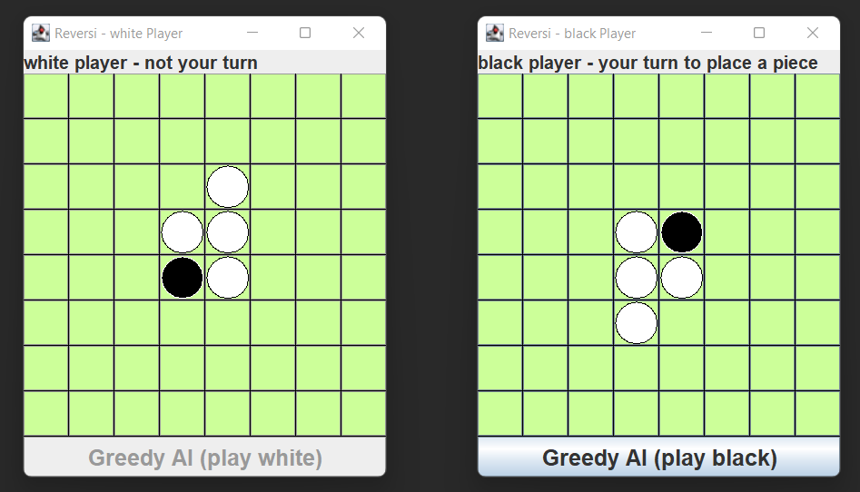

# reversi-othello

Reversi (Othello) boardgame, written in Java.

## Description

Program to play against another player locally, or play against a greedy AI which picks the best move for that turn without regarding future moves.



## How to Run?

**Greedy AI:**
```
git clone https://github.com/xCaspian/reversi-othello.git
cd reversi-othello
cd greedyAI
cd src
javac Main.java
java Main
```
